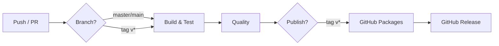

# CI/CD Pipeline

> GitHub Actions workflow for quarkus-nacos-starter — build, test, quality, publish.

## Overview



## Workflow Triggers

| Event | Branch | Jobs |
|-------|--------|------|
| `push` | `master`, `main` | build, quality |
| `pull_request` | `master`, `main` | build, quality |
| `push tag v*` | any | build, quality, publish, release |
| `workflow_dispatch` | any | manual trigger |

## Jobs

### 1. Build & Test (`build`)

Matrix: **JDK 17** × **JDK 21** on ubuntu-latest.

```
mvn validate compile    →  compile + checkstyle
mvn test                →  unit tests
mvn package -DskipTests →  produce JAR
```

Artifacts (`target/*.jar`) are uploaded and retained for 7 days.

### 2. Code Quality (`quality`)

Runs on JDK 17. Non-blocking (`continue-on-error: true`).

| Tool | Command | Checks |
|------|---------|--------|
| Spotless | `mvn spotless:check` | Google Java formatting |
| SpotBugs | `mvn spotbugs:check` | Bug patterns, null-safety |

### 3. Publish (`publish`)

Triggered **only on tag push** (`refs/tags/v*`). Depends on `build` + `quality`.

```bash
mvn deploy -DskipTests
```

Publishes to **GitHub Packages** (`https://maven.pkg.github.com/hack0303/quarkus-nacos-starter`).

Authentication uses the built-in `GITHUB_TOKEN` — no secrets to configure.

**Consuming the package from another project:**

```xml
<repositories>
    <repository>
        <id>github</id>
        <url>https://maven.pkg.github.com/hack0303/quarkus-nacos-starter</url>
        <snapshots><enabled>true</enabled></snapshots>
    </repository>
</repositories>

<dependencies>
    <dependency>
        <groupId>org.cland.chainpay</groupId>
        <artifactId>quarkus-nacos-starter</artifactId>
        <version>1.0.0</version>
    </dependency>
</dependencies>
```

> Requires authentication — create a GitHub PAT with `read:packages` and add it to your Maven `settings.xml`:
> ```xml
> <server>
>     <id>github</id>
>     <username>${env.GH_USERNAME}</username>
>     <password>${env.GH_TOKEN}</password>
> </server>
> ```

### 4. Release (`release`)

Creates a **GitHub Release** with auto-generated changelog (last 20 commits or changes since previous tag).

Attaches `target/*.jar` as release assets.

## Local CI Simulation

```bash
# Simulate CI locally (JDK 17+ required)
mvn clean validate compile test package

# Quality checks
mvn spotless:check
mvn spotbugs:check
```

## Environment Variables

| Variable | Used By | Purpose |
|----------|---------|---------|
| `MAVEN_USERNAME` | publish | GitHub actor (auto-set) |
| `MAVEN_PASSWORD` | publish | `GITHUB_TOKEN` (auto-set) |
| `GITHUB_TOKEN` | release | Permissions for creating releases |

## Adding a New JDK Version

Edit the `matrix.java` list in `.github/workflows/ci.yml`:

```yaml
strategy:
  matrix:
    java: [17, 21, 23]   # ← add version here
```

## File Reference

| File | Purpose |
|------|---------|
| `.github/workflows/ci.yml` | Workflow definition |
| `docs/ci/README.md` | This document |
| `pom.xml` | Maven build (includes `maven-source-plugin` for sources JAR) |

## Related

- [Quarkus Nacos Starter README](../../README.md) — project overview and usage
- [GitHub Actions docs](https://docs.github.com/en/actions)
- [GitHub Packages docs](https://docs.github.com/en/packages)
